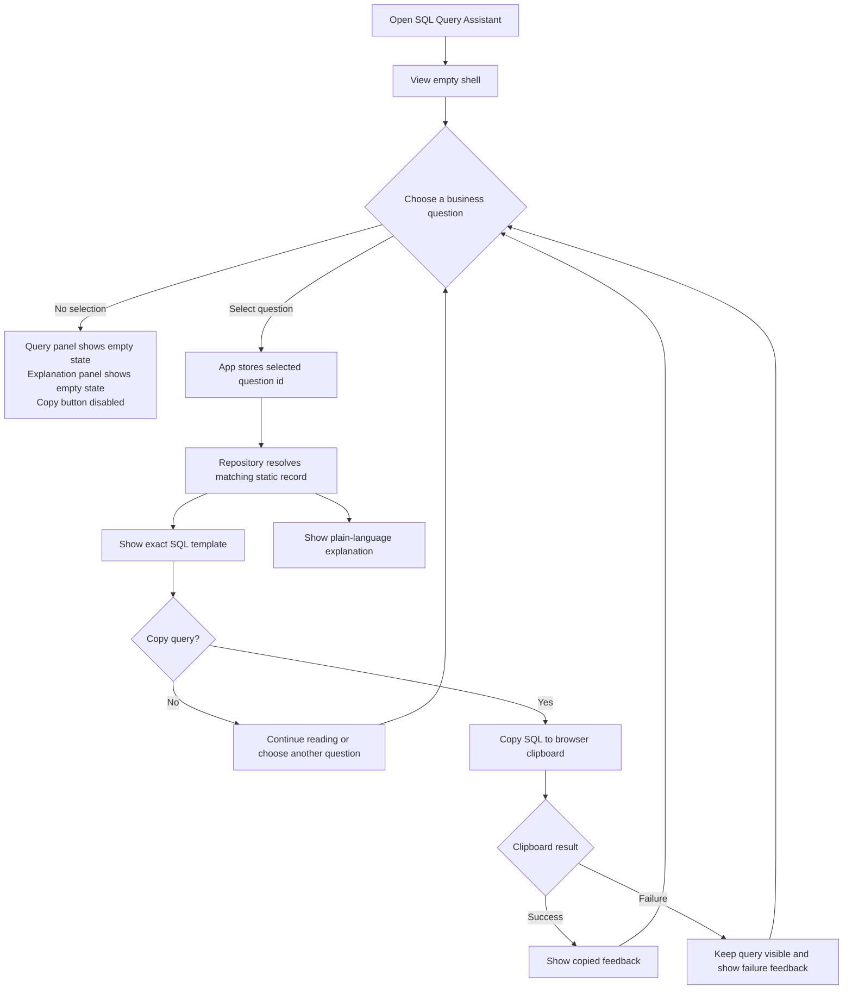
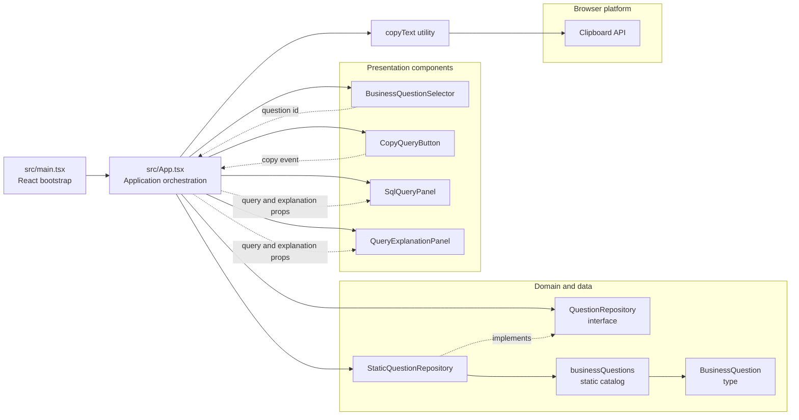
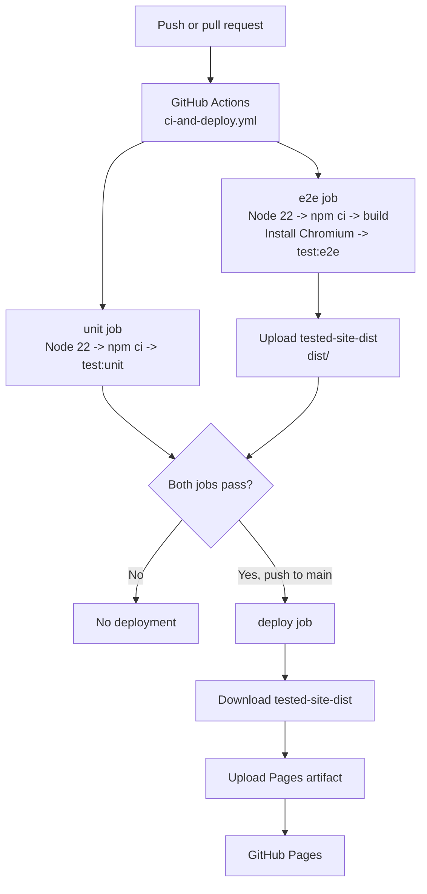

# SQL Query Assistant Architecture Blueprint

**Status:** Current implementation
**Generated:** 2026-09-11
**Primary architecture:** Layered React single-page application with a repository boundary
**Runtime model:** Static browser application; no backend, database, authentication, external API, or AI model

## 1. Architectural Overview

SQL Query Assistant is a frontend-only application that maps a selected business question to a stored SQL example and a plain-language explanation. The browser loads a static Vite bundle. All question records are compiled into the bundle from TypeScript source files, and all user interaction stays in browser memory.

The implementation uses a small layered structure:

| Layer | Responsibility | Implementation |
| --- | --- | --- |
| Composition | Bootstraps React and global styles | `src/main.tsx` |
| Application orchestration | Owns the selected question, copy lifecycle, and workflow handlers | `src/App.tsx` |
| Presentation | Renders controls, query output, explanation, and feedback | `src/components/` |
| Domain | Defines stable business and copy-status types | `src/domain/` |
| Data access boundary | Exposes question lookup operations through an interface | `src/repositories/questionRepository.ts` |
| Data adapter | Validates and serves immutable copies of the static catalog | `src/repositories/staticQuestionRepository.ts` |
| Static data | Stores the five question, SQL, and explanation records | `src/data/businessQuestions.ts` |
| Browser platform adapter | Encapsulates clipboard access and failure handling | `src/utilities/clipboard.ts` |

### Architectural principles

- **Static by design:** The application presents examples and never executes SQL or connects to a database.
- **Dependency direction:** UI orchestration depends on the repository contract and clipboard utility; the presentation layer receives data and callbacks through props.
- **Replaceable catalog source:** `QuestionRepository` allows the static implementation to be replaced later without changing the selector or output panels.
- **Explicit transient state:** Selection and copy status are held in React state; no global store or persistence layer is needed.
- **Testable boundaries:** Repository validation, clipboard behavior, component rendering, workflow behavior, and browser behavior are tested independently.

## 2. User Flow

The primary user is a business analyst, product stakeholder, or developer who needs an understandable SQL example without connecting to a data source.



### User-flow behavior

1. `src/main.tsx` mounts `<App />` in `StrictMode` and loads the application stylesheet.
2. `App` starts with an empty `selectedQuestionId` and `copyStatus: 'idle'`.
3. `BusinessQuestionSelector` receives every record from `questionRepository.getAllQuestions()` and emits an ID when the native select changes.
4. `App` resolves the ID through `getQuestionById`. Before selection, it passes `null` to both output panels.
5. `SqlQueryPanel` renders the stored SQL exactly as provided. `QueryExplanationPanel` renders the stored explanation.
6. `CopyQueryButton` is disabled until a question is selected. `App` calls `copyText` only when a selected record exists and no copy is already in progress.
7. The copy status returns to `idle` after 2.5 seconds for successful or failed feedback. A request-version guard prevents an older clipboard response from overwriting newer selection state.

## 3. Component Diagram



### Component responsibilities

| Component or module | Responsibility | Does not do |
| --- | --- | --- |
| `App` | Coordinates repository lookup, selection state, copy state, transient feedback, and child composition | Render the question catalog itself or execute SQL |
| `BusinessQuestionSelector` | Renders question options and reports the selected ID | Resolve records or own application state |
| `SqlQueryPanel` | Displays exact SQL or its empty state | Transform, validate, or run SQL |
| `QueryExplanationPanel` | Displays explanation text or its empty state | Generate explanations dynamically |
| `CopyQueryButton` | Exposes an accessible copy action and copying state | Access the Clipboard API directly |
| `StaticQuestionRepository` | Validates catalog records and provides defensive copies | Fetch remote data or persist changes |
| `copyText` | Adapts `navigator.clipboard.writeText` to `copied` or `failed` | Store query history or retry indefinitely |

## 4. Data Flow

The system has one primary data flow for question selection and one browser-platform flow for copying. No data crosses a network or database boundary at runtime.

```mermaid
sequenceDiagram
    actor User
    participant Browser as Browser DOM
    participant App as App
    participant Repo as StaticQuestionRepository
    participant Catalog as businessQuestions
    participant Panels as Output panels
    participant Clipboard as navigator.clipboard

    Browser->>App: Mount application
    App->>Repo: getAllQuestions()
    Repo-->>App: Question options
    App->>Panels: query=null, explanation=null
    Panels-->>User: Empty states; copy disabled

    User->>Browser: Select question ID
    Browser->>App: onChange(questionId)
    App->>Repo: getQuestionById(questionId)
    Repo->>Catalog: Find matching ID
    Catalog-->>Repo: BusinessQuestion record
    Repo-->>App: Defensive record copy
    App->>Panels: SQL and explanation props
    Panels-->>User: Exact query and explanation

    User->>Browser: Activate Copy query
    Browser->>App: handleCopy()
    App->>Clipboard: writeText(selectedQuestion.sql)
    alt Clipboard succeeds
        Clipboard-->>App: Resolved promise
        App-->>User: Copied status
    else Clipboard unavailable or rejects
        Clipboard-->>App: Failure
        App-->>User: Failure status; query remains visible
    end
```

### Data contracts and mutability

`BusinessQuestion` is the central domain record:

```ts
interface BusinessQuestion {
  readonly id: string;
  readonly label: string;
  readonly sql: string;
  readonly explanation: string;
}
```

`StaticQuestionRepository` validates non-empty required fields and unique IDs at construction time. It copies records both when storing the catalog and when returning records, preventing callers from mutating the repository's internal array through normal application paths.

The only mutable runtime values are:

- `selectedQuestionId`: the selected catalog key.
- `copyStatus`: `idle`, `copying`, `copied`, or `failed`.
- `copyRequestVersion`: a ref used to ignore stale asynchronous clipboard results.

## 5. Technology Stack

| Concern | Technology | Role |
| --- | --- | --- |
| Language | TypeScript, strict mode | Typed domain contracts, components, repository, and configuration |
| UI runtime | React 19.3 | Component rendering and local state |
| Build and development | Vite 8.3 | Dev server, bundling, static production output |
| Styling | Plain CSS in `src/styles.css` | Responsive single-screen visual system; no runtime styling library |
| Icons | `lucide-react` | UI icons such as database and copy actions |
| Unit/component tests | Vitest 5, Testing Library, jsdom | Component, repository, utility, and workflow tests |
| Browser tests | Playwright 1.63 | End-to-end selection, rendering, timing, keyboard, clipboard, and failure flows |
| Runtime/package manager | Node.js 22 in CI, npm lockfile | Dependency installation and scripts |
| CI/CD | GitHub Actions | Test gates, production build, artifact transfer, and Pages deployment |
| Hosting | GitHub Pages | Static hosting for the generated `dist/` artifact |

### Application dependencies

Production dependencies are deliberately small: `react`, `react-dom`, and `lucide-react`. There is no HTTP client, database driver, server framework, authentication package, state-management package, or AI SDK.

### Development commands

| Command | Purpose |
| --- | --- |
| `npm run dev` | Start the Vite development server on port 5173 |
| `npm run build` | Run TypeScript project build and generate the Vite `dist/` bundle |
| `npm run test:unit` | Run the Vitest suite |
| `npm run test:e2e` | Run Playwright tests against a Vite preview server on port 4173 |

## 6. Deployment Architecture



### Deployment behavior

- Every push and pull request starts the unit and browser-test jobs.
- The browser-test job builds the production bundle before testing it through `vite preview`; this ensures the deployed artifact is the one that was exercised by Playwright.
- Chromium is installed in CI with `npx playwright install --with-deps chromium`.
- The `tested-site-dist` artifact is uploaded only after browser tests pass.
- Deployment runs only for a push to `main` and requires both `unit` and `e2e` jobs through `needs: [unit, e2e]`.
- The deploy job downloads the tested artifact, configures GitHub Pages, uploads the static Pages artifact, and invokes `actions/deploy-pages`.
- Vite uses `base: './'`, so generated asset paths remain relative and work when hosted under a GitHub Pages project path.

### Environment boundaries

There are no application environment variables or runtime secrets. GitHub Actions uses repository and Pages permissions for deployment, but the browser bundle contains only public static examples. The application must not be extended to place credentials, database connection strings, or private data in `src/data/` or the generated `dist/` output.

## 7. Testing Architecture

Testing follows the same boundaries as the implementation:

- **Domain/data tests:** Validate catalog shape, repository lookup, defensive copies, and invalid-record rejection.
- **Component tests:** Exercise selector options, empty states, query rendering, explanation rendering, button state, and feedback.
- **Workflow tests:** Exercise `App` selection, copy success, copy failure, and stale-request behavior.
- **Browser tests:** Verify the complete static shell, all five catalog records, selection latency, keyboard operation, clipboard contents, and denied clipboard feedback.
- **CI tests:** Run unit tests on every push and pull request; run build plus browser tests before producing the deployment artifact.

## 8. Extension Blueprint

### Adding a new business question

1. Add a `BusinessQuestion` record to `src/data/businessQuestions.ts`.
2. Use a unique non-empty `id`, label, SQL string, and explanation.
3. Keep SQL as display-only content; do not add execution logic.
4. Extend repository or workflow fixtures if the new record changes expected catalog counts.
5. Add or update unit and Playwright assertions for the new question.

### Replacing the static catalog

Implement `QuestionRepository` with an adapter that provides the same `getAllQuestions` and `getQuestionById` contract. Keep the UI dependent on the interface rather than the adapter. If a remote source is ever introduced, add explicit loading, failure, caching, and security boundaries rather than coupling network calls directly to presentation components.

### Adding a new browser capability

Put browser APIs behind a small utility like `src/utilities/clipboard.ts`. Convert platform failures into a typed result that `App` can render. This keeps browser-specific behavior out of presentational components and makes the capability testable in isolation.

## 9. Architectural Constraints and Risks

- The catalog is compiled into the client bundle, so it is public and cannot represent confidential or live business data.
- SQL examples are not parsed or executed; syntax correctness is a content-maintenance responsibility.
- There is no persistence: selection and copy feedback disappear on reload.
- GitHub Pages is static hosting; features requiring server-side computation need a separate service boundary and deployment design.
- The current CI deploy gate is enforced by workflow dependencies. Repository Pages configuration and permissions must remain enabled for deployment to succeed.

This document should be updated when the repository boundary, runtime data source, CI workflow, or deployment target changes.
